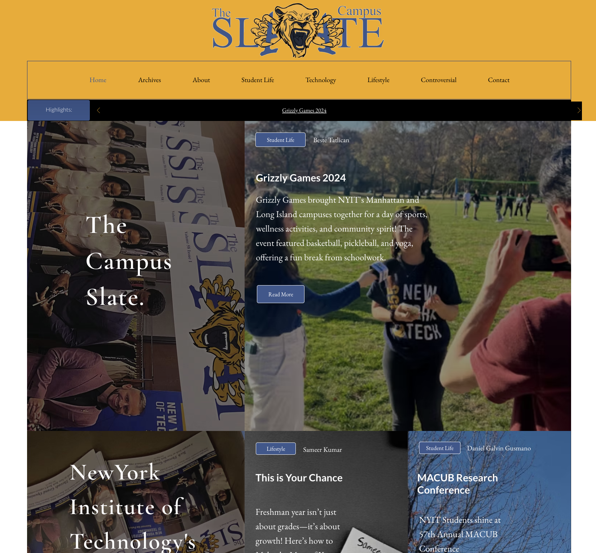
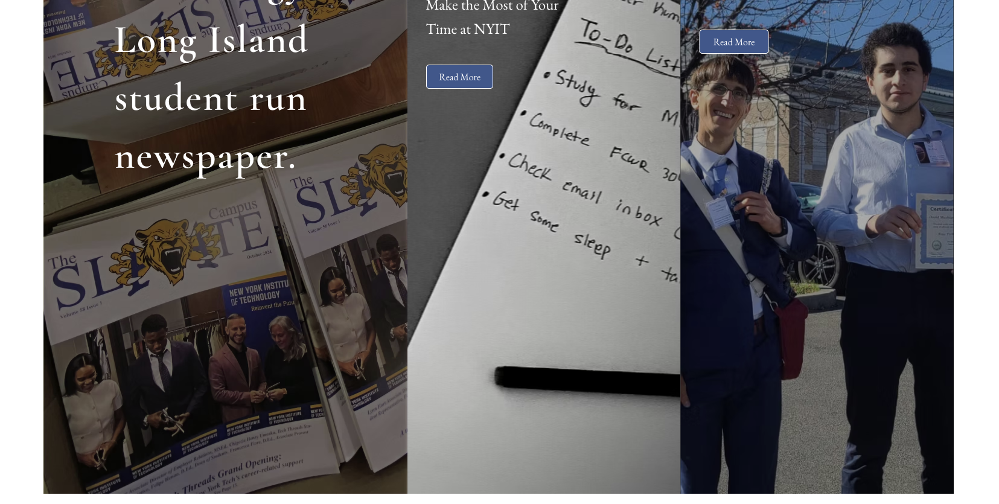
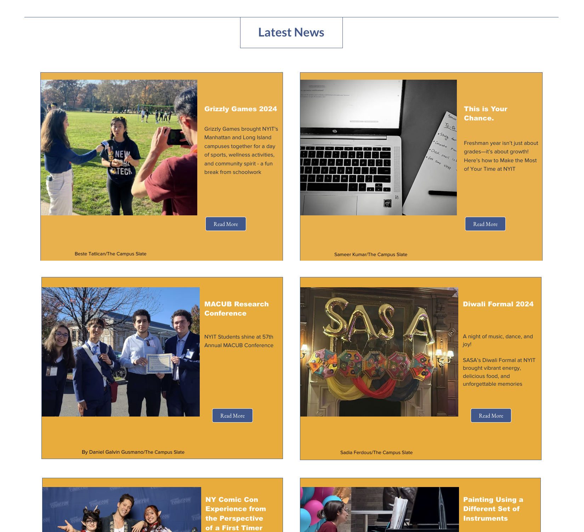
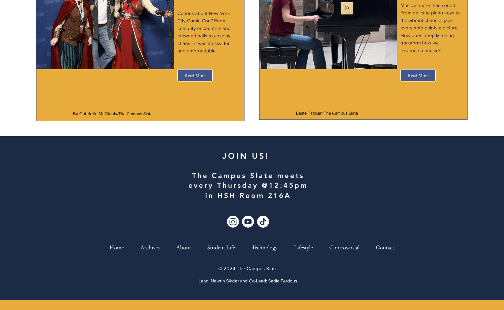

# The Campus Slate - University Student Run Newspaper Website
This repository showcases the design and development of The Campus Slate student-run newspaper website. 

## Overview
- End-to-end design
- Front-end development and implementation
- Responsive layout for both desktop and mobile interfaces
- Organized article and archives
- Accessibility focused UX/UI

## Tech Stack 
- HTML
- CSS
- JavaScript
- Git/Github
- Wix

## Screenshots 

## Status 
- Previously deployed and utilized
- Currently under active reconstruction

## Future Improvements 
- Enhanced archive search 
